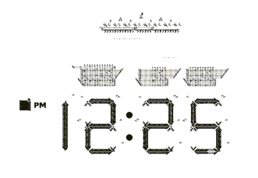

# Conway's Game Of Life

**John H. Conway** (1937 - 2020), an English mathematician is well known for creating a cellular automaton known as the Game of Life. Sadly, he recently passed away due to complications from Covid-19 and this little project is a tribute to him.

## What is Game of Life anyway?

It is a game with 0 players placed on an infinite grid where each cell can either be "alive" or "dead". The next grid state is calculated from the present one following few simple rules:


 - Any cell with less than 2 neighbors dies (underpopulation)
 - Any cell with more than 3 neighbors dies (overpopulation)
 - Any dead cell with 3 live neighbors becomes alive
 - Other cells are not affected

Following these rules, a new board state can be calculated from the current one and the process goes on indefinitely. 


## Implementation

[](https://www.youtube.com/watch?v=KaBm4etcYFQ)

#### Click on the image to see the project's video output!

Aiming for simplicity, the highest possible resolution is aimed at with as few lines of code as possible. The project is designed to run on the [MiSTer](https://github.com/MiSTer-devel/Main_MiSTer/wiki) platform, a very popular and widespread retro gaming system based on the [Terasic DE10-Nano](http://de10-nano.terasic.com) FPGA board featuring Intel Cyclone V FPGA chip.

There are many clever techniques to achieve higher GoL framerates, but the limiting factor is what you can view them on and for most people that's 1080p at 60Hz. This is not a highly complex FPGA project and should not be viewed as such - it is more of an **educational attempt** to practice and learn.

### Architecture


The entire game is implemented as two small shift registers for rows 1 and 2 and a large one which holds the remaining rows. Rows 1 and 2 are deliberately 2 pixels short, and have two separate registers added in front of them. This enables direct access to all neighbor cells of cell (1,1) and it is possible to determine the faith of this cell in the next generation.

This future cell is shifted into the large shift register and the original cell keeps getting shifted to old row 1 to be used for remaining calculations. The whole process then repeats indefinitely. There are probably better ways to do this, but this one seemed simple enough to use. 

### Logic

Rows are implemented by using *altshift_taps* component from Intel/Altera, providing a very simple shift register interface (clock, in, out).

The entire game logic can be simplified to **one line**:

   ```verilog
   output_pixel <= (neighbor_count | r2p2) == 4'd3;
   ```

Neighbor count is defined as the number of live surrounding cells around the cell in focus (row 2 pixel 2).
Future cell is alive if it has 3 live neighbors, and in that case it doesn't matter if r2p2 is dead or alive. If there are only two live neighbors, that's 10 in binary and it can equal 3 only if r2p2 is alive, so that checks out too. 

Implementing random seed gives you the idea just how much raw bandwidth flows to the monitor. To generate random data, I tried to find a LFSR but all the modules I stumbled upon seemed waaaay too complicated for me (seen one with 440 lines), so I decided to roll out my own:

```verilog
   reg [30:0] lfsr;
  
   always @(posedge clock) begin
     lfsr <= {lfsr[29:0], lfsr[30] ^~ lfsr[27]}; 
   end   
```

That's it! Interesting application note on LFSRs can be found [here](https://www.xilinx.com/support/documentation/application_notes/xapp052.pdf).


## Game of Life Trivia

The fascinating thing is that it is [Turing complete](https://en.wikipedia.org/wiki/Turing_completeness)  and it could, in theory, calculate anything your computer could. [This is how](http://rendell-attic.org/gol/tm.htm) one of the possible implementations looks like. Also, some cool feats like this amazing digital clock [4] can be constructed.



## Installation

Copy .rbf to the root of your SD card and load it. The screen will be blank, which is OK. You can either generate some random seed from the menu (F12, turn random seed on and off) or load an existing board.

## Loading a board

First, copy the board image to your SD card. It is a simple file containing 2200 x 1125 bytes (visible + invisible area) representing pixels.

To load it, select F12 menu and choose load board *.MEM option. Select your file and press enter. 

## OSD menu options

* **Running** - [Yes/No] It enables you to pause and unpause the game
* **Random Seed** - [Off/On] Fills the buffer with random data
* **Aspect Ratio** - [16:9/4:3] Selects the display's aspect ratio.

### FAQ

##### Q. The board is not infinite as the game states

A. Board size is limited by the memory available.

##### Q. There is a problem with video output

A. This core uses the new open source video scaler for MiSTer. First try upgrading MiSTer to the latest version, then consider creating a [MiSTer.ini](https://github.com/MiSTer-devel/Main_MiSTer/blob/master/MiSTer.ini) file in the config folder of your SD card and try choosing another video mode.

##### Q. Video geometry is wrong

A. Try switching the aspect ratio from OSD (press F12 to access it).

##### Q. Memory files are HUGE

A. They are, indeed, very inefficient but they compress well as their entropy is low. The idea was to implement a RLE encoding format, but there is an issue with ioctl_wait that needs to be addressed before or a different approach to file transfer taken (SD card vhd image and transfer in chunks).

## Known issues and missing features

- Board wraps around
- RLE file format should be implemented instead of the current crappy one

## License

This software is licensed under the MIT license.

## Bibliography

  1. [Conway's Game of Life, Wikipedia](https://en.wikipedia.org/wiki/Conway%27s_Game_of_Life)   accessed 27.04.2020.
  2. [Game of Life Turing machine](http://rendell-attic.org/gol/tm.htm) accessed 27.04.2020.   
  3. Gardner, Martin (October 1970). ["Mathematical Games - The Fantastic Combinations of John Conway's New Solitaire Game 'Life'" (PDF)](https://web.stanford.edu/class/sts145/Library/life.pdf). Scientific American (223): 120–123
  4. [Digital clock in Game of Life](https://codegolf.stackexchange.com/questions/88783/build-a-digital-clock-in-conways-game-of-life), accessed 27.04.2020.